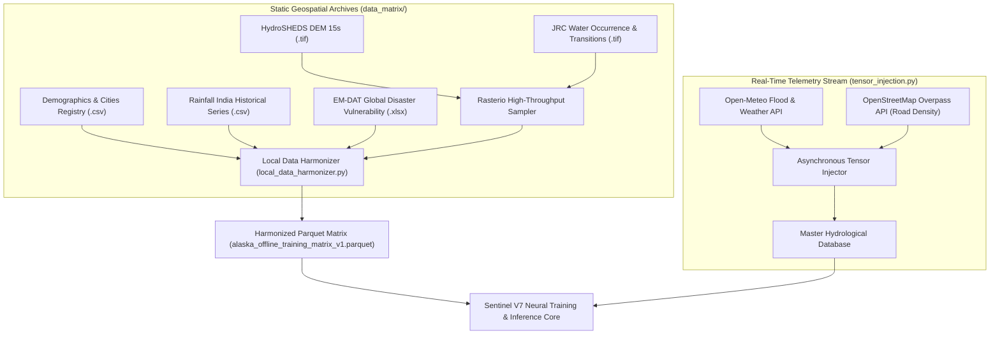

# ALASKA Sandbox: Geospatial Harmonizer & Tensor Injection Engine

[](LICENSE)
[](https://www.python.org/)
[](https://rasterio.readthedocs.io/)
[](https://arrow.apache.org/)

**ALASKA Sandbox** is the offline geospatial data harmonizer and asynchronous tensor ingestion pipeline designed for **Sentinel V7.0** spatiotemporal hydrological risk forecasting.

It synthesizes multi-modal geospatial raster archives (HydroSHEDS Digital Elevation Models, JRC Global Surface Water occurrence/transitions) with tabular demographic, precipitation, and water quality registries into unified, compressed **Apache Parquet** training matrices.

---

## 1. System Pipeline Architecture



---

## 2. Directory Structure

```
ALASKA_SANDBOX/
├── data_matrix/
│   └── static_archives/          # Tabular & spatial demographic registries
│       ├── demographics/         # Urban centers and population densities
│       ├── em_dat/               # Historical disaster impact records
│       ├── hydrosheds/           # HydroSHEDS documentation
│       ├── rainfall/             # Precipitation history
│       └── water_quality/        # Environmental water quality indicators
├── local_data_harmonizer.py      # Rasterio sampling & Parquet fusion pipeline
├── tensor_injection.py           # Asynchronous live API feature injection engine
├── requirements.txt              # Pipeline dependencies (rasterio, pyarrow, httpx)
├── .env.example                  # Environment configuration template
└── README.md                     # Pipeline documentation
```

> **Note on Geospatial Rasters**: The large GeoTIFF datasets (`hyd_as_dem_15s.tif`, `occurrence_*.tif`) exceed GitHub's 100 MB file limit and are excluded via `.gitignore`. Download links and instructions for acquiring them directly from HydroSHEDS and the EU Joint Research Centre (JRC) are documented below.

---

## 3. Quickstart & Usage

### Prerequisites
- Python 3.10+
- GDAL / PROJ (for Rasterio)
- Git

### Installation

1. **Clone the repository:**
   ```bash
   git clone https://github.com/abdullah00ashraf/alaska-tensor-sandbox.git
   cd alaska-tensor-sandbox
   ```

2. **Create a virtual environment:**
   ```bash
   python -m venv .venv
   # Windows:
   .venv\Scripts\activate
   # Linux/macOS:
   source .venv/bin/activate
   ```

3. **Install dependencies:**
   ```bash
   pip install -r requirements.txt
   ```

4. **Environment Setup:**
   ```bash
   cp .env.example .env
   # Edit .env with your optional API keys (Gemini / Groq)
   ```

### Executing the Data Harmonizer

```bash
python local_data_harmonizer.py
```
This will:
1. Generate an evenly distributed spatiotemporal coordinate grid across the target division.
2. Sample elevation and surface water transition metrics using Rasterio.
3. Merge tabular demographics and rainfall series.
4. Output a compressed `full_data/harmonized_matrix/alaska_offline_training_matrix_v1.parquet`.

### Executing the Tensor Injection Engine

```bash
python tensor_injection.py
```
Streams live Open-Meteo precipitation, river discharge, and Overpass road density metrics asynchronously into the feature matrix.

---

## 4. External Geospatial Data Acquisition

If you require the high-resolution raw satellite rasters:
- **HydroSHEDS DEM (15 arc-seconds)**: Available from [USGS / HydroSHEDS](https://www.hydrosheds.org/)
- **JRC Global Surface Water**: Available from the [European Commission Copernicus Data Hub](https://global-surface-water.appspot.com/)

Place the acquired `.tif` files into `data_matrix/static_archives/hydrosheds/` and `data_matrix/static_archives/jrc_water/` respectively.

---

## 5. License

This project is licensed under the [MIT License](LICENSE) - see the LICENSE file for details.
